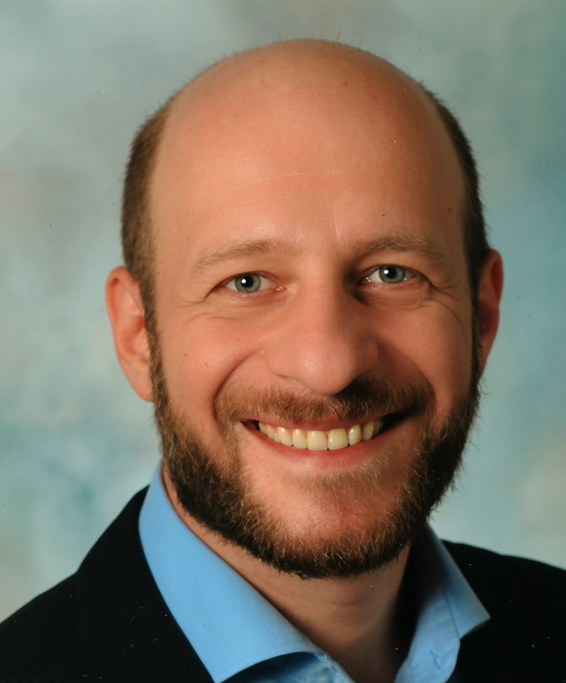

# George Mamaladze
{: .profile-image}

---

[linkedin.com/in/gmamaladze](https://www.linkedin.com/in/gmamaladze)  
[Download CV as PDF](George Mamaladze CV.pdf)

### Currently

**Senior Software Architect at Siemens AG** – Factory Automation, Human Machine Interface in Munich, Germany

**Chief Technical Advisor at Syniotec** (part-time, freelance), Bremen, Germany (remote)

### Specialized in

Technology strategy, cloud-native architectures, microservices, team leadership, and industrial automation software

### Professional Summary

A technology leader with over 25 years of experience designing, building, and delivering impactful software solutions. I combine deep conceptual technical knowledge and hands-on expertise with the ability to build and lead high-performing teams. My experience extends from interfacing with customers, understanding requirements to collaborating with executive leadership to ensure timely delivery and strategic market fit.

---

## Experience

`May 2022 - Present`
__Senior Software Architect__, *Siemens AG – Factory Automation, Human Machine Interface*, Munich, Germany

The SIMATIC WinCC Unified System is a new generation of Siemens HMI and SCADA visualization products designed for industrial applications in machine building and factory automation ([siemens.com/wincc-unified](https://www.siemens.com/wincc-unified)). It addresses the modern challenges of digitization in manufacturing by providing a flexible and open platform with IT/OT integration capabilities.

**Responsibilities**
- Defining technology strategy, aligning product roadmap with business goals and partners
- Led and mentored the engineering team Architects
- Drove the technology roadmap, scanning for innovations, defining development guidelines and tool chains
- Oversaw the entire development lifecycle, allocating technical resources, collaborating with product owners, finance, and executive leadership to ensure timely delivery and market fit

**Key Achievement**
- After 3 years of development of the newly founded business line, delivered the first version of the product to market (currently in limited release, broad release planned)

`Jul 2022 - Present`
__Chief Technical Advisor (part-time, freelance)__, *Syniotec*, Bremen, Germany (remote)

[Syniotec](https://www.syniotec.com) is a fast-growing startup providing digital solutions to the construction industry, enabling companies to optimize operations through IoT-driven telematics and software platforms. As Chief Technical Advisor, I function in practice as the part-time CTO, shaping product vision, technical strategy, and long-term platform strategy.  

**Responsibilities**  
- Defined the technical roadmap ensuring scalability, security, and maintainability.  
- Advised the founding team and management.  
- Mentored engineering teams on best practices in microservices, DevOps, and cloud infrastructure.  
- Managed technology stack, vendor partnerships, and integration strategies.  

**Key Achievements**  
- Established technical standards and processes that enabled Syniotec’s transition from startup to scaling vendor.  
- Redesigned the cloud-native backbone of Syniotec software to scale for thousands of concurrent users and data streams.  

`May 2018 - May 2022`
__Senior Software Architect__, *Siemens AG – Corporate Technology*, Munich, Germany

Siemens Corporate Technology served as the central research and innovation hub for Siemens AG.  

**Responsibilities**  
- Designed and conceived cloud-native system architectures for strategic projects.  
- Advised business units on cloud transformation and innovation.  
- Performed architecture reviews and mentored development teams.  
- Conducted technology research, academic collaboration, and conference talks.  

**Key Achievements**  
- Led the architecture for Spectrum Power digital grid control system (real-time platform with Kubernetes, Kafka, Flink).  
- Architected “Energy as a Service,” a scalable microservice platform for renewable energy analytics.  

`Oct 2018 - Jan 2019`
__International Advisor for Small Businesses (ASB)__, *EBRD (European Bank for Reconstruction and Development)*, Global (part-time, freelance)

- Provided strategic guidance and coaching to small businesses in Eastern Europe & CIS
- Mentored software teams in modern engineering practices and agile methods
- Reworked system architectures to align with business objectives
- Introduced structured processes, tools, and templates to improve execution

`Mar 2017 - Apr 2018`
__Principal Software Architect__, *Huawei – European Research Center*, Munich, Germany

- Provided technical leadership for 3–5 concurrent high-impact research projects
- Drove project acquisition, requirement analysis, and technical consulting at HQ in China
- Disseminated research findings and knowledge

**Key Achievements** 

- Architected methodology and toolchain for modularizing large-scale Java projects. 
- Designed scalable microservice architecture for Huawei Cloud IDE.

`Jul 2009 - Feb 2017`
__Senior Software Architect__, *Siemens AG – Digital Factory*, Fuerth, Germany

- Software Architect, promoted to Certified Senior Software Architect (2015).  
- Worked on [TIA-Portal](https://www.siemens.com/tia-portal), Siemens’ flagship automation IDE, shipping 5 major releases.  
- Managed development across full stack (hardware, firmware, application).  
- Interfaced with customers and partners for product launches

`Feb 2008 - Jun 2009`
__Senior Software Architect__, *encad Ing. mbH*, Nuremberg, Germany

- Assigned to a customer project with 50+ developers
- Conducted architecture reviews and systemic root cause analyses
- Introduced CI, static code analysis, and quality assurance measures

`Aug 2001 - Jan 2008`
__Software Project Lead__, *IQ-optimize Software AG*, Nuremberg, Germany

- Launched Germany’s first digital prepaid voucher distribution system with a 10-person team.  
- Managed lifecycle of a back-office workflow system (product ownership → development → customer training).  

`Jan 1999 - Jul 2001`
__Head of IT Department__, *TBC Bank*, Tbilisi, Georgia

- Managed IT infrastructure, ATMs, POS systems, and integrations
- Oversaw administration and supervision of hardware and software

---

## Education

`Sep 2003 - Aug 2004`
__Post-graduate Studies in Computer Science__, *FernUni Hagen*, Hagen, Germany

- Free student (Gasthörer), completed 4 semesters

`Sep 1993 - Jun 1999`
__Diploma in Computer Science__, *Tbilisi State University*, Tbilisi, Georgia

- Faculty of Applied Mathematics and Computer Science
- Scholarship holder of the George Soros Foundation

`Sep 1989 - May 1993`
__Specialized School for Physics and Mathematics__, *High School*, Tbilisi, Georgia

- Graduated with honors
- Winner (1st Place), International Young Physicists' Tournament

## Achievements

`2018`
Certified AWS Solution Architect

`2015`
CodeProject MVP

`2014`
Certified Senior Software Architect

`2013`
Member of Agile Alliance

Agile Manifesto Translator

Co-author of several patents

Open Source Enthusiast

## Languages

**Fluent:** English, German  
**Basic:** Chinese  
**Native:** Russian, Georgian

## Technical Skills

#### Languages & Frameworks
`C#` `Java` `Python` `TypeScript` `Node.js` `ASP.NET Core` `Angular`

#### Architecture
`OO-Patterns (GoF)` `Microservice Patterns` `Architecture Evaluation` `Requirements Engineering` `Domain Driven Design` `Testing Strategies` `Guidance & Governance` `Continuous Delivery` `AWS Well-Architected Framework` `Cloud Cost Management` `Event-Driven Architecture`

#### Platforms & Products
`Cloud Platforms` `Kubernetes` `Kafka` `Flink` `PostgreSQL` `DynamoDB` `Terraform` `Prometheus` `Grafana` `OpenTelemetry`

#### Tools
`Git` `Azure DevOps` `Visual Studio Code` `IntelliJ IDEA` `Docker` `GitHub Actions` `GitLab CI` `SonarQube` `JFrog`

#### Practices
`Agile` `Scrum` `Lean Management` `Clean Code` `TDD` `CI/CD` `Management 3.0`

